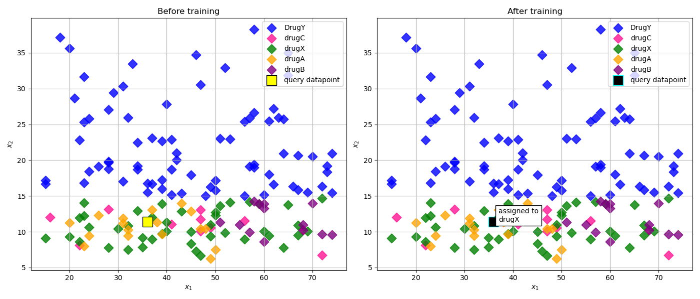

# k-Nearest Neighbors (kNN) Drug Classification

This project demonstrates a **k-Nearest Neighbors (kNN)** algorithm implementation to classify drug types based on patient medical features. It includes a clear **before-and-after training visualization**, showing how kNN assigns a class label to a query datapoint.

---

## Dataset: `drug200.csv`

The dataset contains **200 records** representing patients and the drugs they were prescribed based on certain medical attributes.

### Features:
- `Age`: Patient age (numerical)
- `Sex`: Categorical (`F`, `M`)
- `BP`: Blood pressure level (`LOW`, `NORMAL`, `HIGH`)
- `Cholesterol`: Cholesterol level (`NORMAL`, `HIGH`)
- `Na_to_K`: Sodium-to-potassium ratio (numerical)

### Target:
- `Drug`: Drug prescribed (`DrugY`, `drugX`, `drugC`, `drugA`, `drugB`)

---

## Implementation Details

The implementation follows these steps:

1. **Preprocessing**
   - Encodes categorical features using `LabelEncoder`.
   - Splits data into train/test sets using `train_test_split`.

2. **Training**
   - Trains a `KNeighborsClassifier` with `n_neighbors=5`.

3. **Prediction**
   - Selects one query datapoint from the test set.
   - Predicts its label based on the 5 nearest neighbors.
   - Uses **majority voting** among neighbors to determine the predicted drug.

4. **Visualization**
   - Displays a side-by-side plot:
     - **Before Training**: Query datapoint is shown but not labeled.
     - **After Training**: Query datapoint is assigned a class and visually annotated.

---

## Final Output Graph

The following plot shows the actual result of the kNN classifier before and after assigning a class to the query point.



---

## Output Example

- **5 Nearest Neighbors:** `['drugX', 'drugX', 'drugY', 'drugX', 'drugX']`
- **Predicted Drug (Majority Vote):** `drugX`
- **Test Accuracy:** ~70–80% (may vary slightly by run)

---

## Requirements

- `pandas`
- `matplotlib`
- `scikit-learn`

Install via pip if needed:
```bash
pip install pandas matplotlib scikit-learn
```

---

## Run the Code

The main script is in `kNN.py`. You can run it with:

```bash
python kNN.py
```

It will:
- Train the kNN model
- Print nearest neighbor results
- Generate and save a PNG graph named: `knn_before_after.png`

---

## Conclusion

This project visualizes the inner workings of kNN by showing the classification process step-by-step in a two-dimensional graph. It’s ideal for learning how instance-based classification works and how majority voting leads to class assignment.

